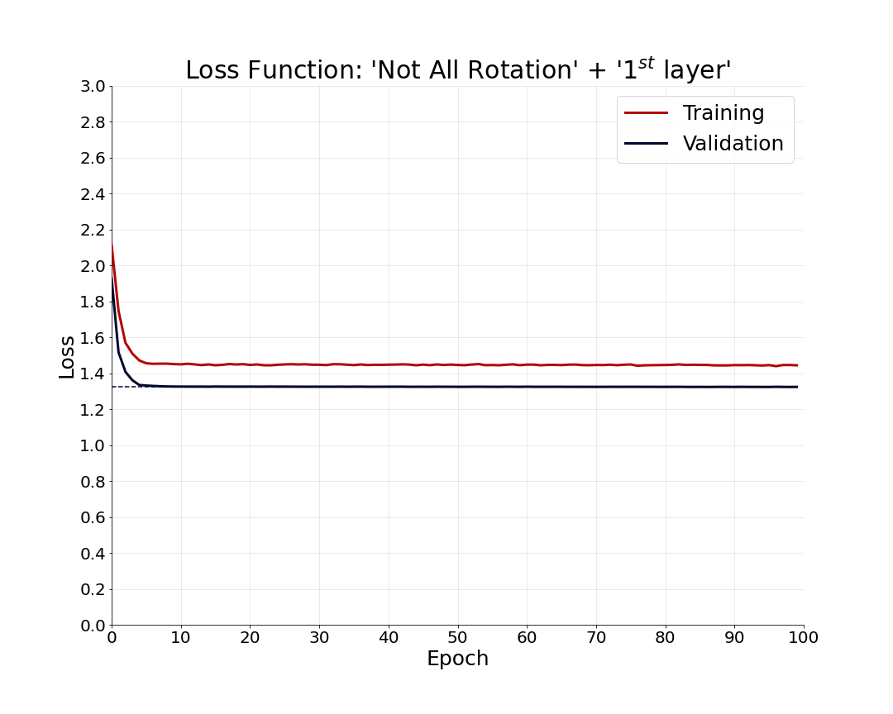

# Unsupervised Representation Learning by Predicting Image Rotations

<ul>
	<li>
		Method: <strong>Self-Supervised</strong>
		<ul>
			<li>
				Proxy Problem: <strong>Predicting Image Rotations</strong>
			</li>
		</ul>
	</li>
</ul>

# Proxy Problem

For self-supervised representation learning, a neural network is trained to predict the rotation applied to the input image. If the function $ Rot(X, \phi) $ rotates the input image $X$ by $\phi$ degrees, the function $g_{K}(X,y)$ is defined as follows:

$$g_{K}(X,y) = Rot(X, \frac{2\pi}{K} y)$$

The $g_{K}(X,y)$ function applies K different rotations to the input image $X$ and actually the $y$ value represents one of these $K$ rotations:

$$ y = \{0,1,\dots,K-1\}$$

In the proxy problem, we are looking for a neural network ($F$) that can find the amount of rotation. Since there are K different rotations, we have a K-class classification problem. Therefore, the neural network $F$ is trained to find the probability of each of the K rotations. The probablity of $\frac{2\pi}{K} y^{\star}$ rotation is defined as follows:

$$ F^{y^{\star}}(\hat{x}|\theta)$$

In the above expression, $\theta$ is the network parameters.

# Loss Function
The loss value for input $X_{i}$ is calculated as follows:

$$loss(X_{i}, \theta) = -\frac{1}{K} \sum_{y=1}^{K}{log( F^{y}(g(X_{i},y)|\theta) )}$$

Therefore, the totall loss value for dataset $ D=\{X_{i} | 1 \le i \le N \}$ is:

$$ Loss(D, \theta) = \frac{1}{N} \sum_{i=1}^{N}{loss(X_{i},\theta)} $$

# Objective
In this problem, the objective is to reduce the totall loss value, or in other words, the goal is to increase the probability of correctly detecting a rotation.

$$ \min_{\theta} Loss(D, \theta) $$

<table style="text-align: center margin-left: auto; margin-right: auto; text-align: center" border=0 align=center>
    <tbody>
        <tr>
            <td>
                
            </td>
        </tr>
        <tr>
        	<td>
        		Unsupervised Representation Learning by Predicting Image Rotations
        	</td>
        </tr>
    </tbody>
</table>

# Image Classification with Learned Representation

The input image can be classified with the representations of intermediate layers. For this purpose, some classification layers should be added after the that layer. Depending on which layer is used, the classification accuracy can be different.

# Dataset

<ul>
	<li>
		<a href="https://www.cs.toronto.edu/~kriz/cifar.html">Cifar-10</a>
		<ul>
			<li>
				<strong>Labels:</strong> 
				<ul>
					<li>
						[<code>airplane</code>, <code>automobile</code>, <code>bird</code>, <code>cat</code>, <code>deer</code>, <code>dog</code>, <code>frog</code>, <code>horse</code>, <code>ship</code>, <code>truck</code>]
					</li>
				</ul>
			</li>
			<li>
				<strong>Training vs Testing Distribution:</strong>
				<table style="text-align: center margin-left: auto; margin-right: auto; text-align: center" border=0 align=center>
				    <tbody>
				        <tr>
				            <td>
				                
				            </td>
				        </tr>
				    </tbody>
				</table>
			</li>
			<li>
				<strong>Some samples from training and testing data:</strong>
			</li>
		</ul>
	</li>
</ul>

<table style="text-align: center margin-left: auto; margin-right: auto; text-align: center" border=0 align=center>
    <tbody>
        <tr>
            <td>
                
            </td>
        </tr>
        <tr>
        	<td>
        		A sample from Training Data
        	</td>
        </tr>
    </tbody>
</table>

<table style="text-align: center margin-left: auto; margin-right: auto; text-align: center" border=0 align=center>
    <tbody>
        <tr>
            <td>
                
            </td>
        </tr>
        <tr>
        	<td>
        		A sample from Testing Data
        	</td>
        </tr>
    </tbody>
</table>

# Experiment: Learning Representation
To learn the representation with the method introduced above, the <strong>ResNet-34</strong> network is used. The training parameters of this model are listed in the table below.

<table style="text-align: center margin-left: auto; margin-right: auto; text-align: center" border=0 align=center>
	<thead>
		<tr>
			<th>Parameters</th>
			<th>Value</th>
		</tr>
	</thead>
    <tbody style="text-align: center margin-left: auto; margin-right: auto; text-align: center" border=0 align=center>
        <tr>
            <td>
                Optimization Algorithm
            </td>
            <td>
                <code>Adam</code>
            </td>
        </tr>
        <tr>
            <td>
                Number of Epochs
            </td>
            <td>
                20
            </td>
        </tr>
        <tr>
            <td>
                Batch Size
            </td>
            <td>
                1024
            </td>
        </tr>
        <tr>
            <td>
                Intial Learning Rate
            </td>
            <td>
                1e-3
            </td>
        </tr>
        <tr>
            <td>
                Weight Decay
            </td>
            <td>
                5e-4
            </td>
        </tr>
    </tbody>
</table>

# Experiment: Image Classification
To classify images, a classification module can be added after each residual block. The specifications of this classification module are as follows (<code>e</code>: representation size):

<table style="text-align: center margin-left: auto; margin-right: auto; text-align: center" border=0 align=center>
	<thead>
		<tr>
			<th><strong>Classification Module</strong></th>
		</tr>
	</thead>
    <tbody style="text-align: center margin-left: auto; margin-right: auto; text-align: center" border=0 align=center>
        <tr>
            <td>
                Batch-Normalization
            </td>
        </tr>
        <tr>
            <td>
                Fully-Connected (e → e/2)
            </td>
        </tr>
        <tr>
            <td>
                Dropout
            </td>
        </tr>
        <tr>
            <td>
                Fully-Connected (e/2 → e/4)
            </td>
        </tr>
        <tr>
            <td>
                Dropout
            </td>
        </tr>
        <tr>
            <td>
                Fully-Connected (e/4 → # of classes (10) )
            </td>
        </tr>
    </tbody>
</table>

# Experiment: Training Image Classifier
In this experiment, in addition to testing the effect of different layers on the accuracy of classification, two different methods for training classifier are compared.

<ol type="i">
	<li>
		In the first method, in an epoch, each image is shown only once and with a random rotation value.
	</li>
	<li>
		In the second method, all possible rotations for each image are applied and all rotated images is shown to the model in an epoch.
	</li>
</ol>

The training parameters of classifier in both methods are listed in the table below.

<table style="text-align: center margin-left: auto; margin-right: auto; text-align: center" border=0 align=center>
	<thead>
		<tr>
			<th>Parameters</th>
			<th>Value</th>
		</tr>
	</thead>
    <tbody style="text-align: center margin-left: auto; margin-right: auto; text-align: center" border=0 align=center>
        <tr>
            <td>
                Optimization Algorithm
            </td>
            <td>
                <code>Adam</code>
            </td>
        </tr>
        <tr>
            <td>
                Number of Epochs
            </td>
            <td>
                100
            </td>
        </tr>
        <tr>
            <td>
                Batch Size
            </td>
            <td>
                1024
            </td>
        </tr>
        <tr>
            <td>
                Intial Learning Rate
            </td>
            <td>
                1e-3
            </td>
        </tr>
        <tr>
            <td>
                Weight Decay
            </td>
            <td>
                5e-4
            </td>
        </tr>
    </tbody>
</table>

# Results: Loss Values

<table style="text-align: center margin-left: auto; margin-right: auto; text-align: center" border=0 align=center>
	<thead>
		<tr>
			<th>Res. Block</th>
			<th>Method "i"</th>
			<th>Method "ii"</th>
		</tr>
	</thead>
    <tbody style="text-align: center margin-left: auto; margin-right: auto; text-align: center" border=0 align=center>
        <tr>
            <td>
                1
            </td>
            <td>
                
            </td>
            <td>
                
            </td>
        </tr>
        <tr>
            <td>
                2
            </td>
            <td>
                
            </td>
            <td>
                
            </td>
        </tr>
        <tr>
            <td>
                3
            </td>
            <td>
                
            </td>
            <td>
                
            </td>
        </tr>
        <tr>
            <td>
                4
            </td>
            <td>
                
            </td>
            <td>
                
            </td>
        </tr>
        <tr>
        	<td colspan=3>
        		Classifier loss value on the representation of different residual blocks after training with the (i) and (ii) methods.
        	</td>
        </tr>
    </tbody>
</table>

# Results: Learning Rate Scheduling

<table style="text-align: center margin-left: auto; margin-right: auto; text-align: center" border=0 align=center>
	<thead>
		<tr>
			<th>Res. Block</th>
			<th>Method "i"</th>
			<th>Method "ii"</th>
		</tr>
	</thead>
    <tbody style="text-align: center margin-left: auto; margin-right: auto; text-align: center" border=0 align=center>
        <tr>
            <td>
                1
            </td>
            <td>
                
            </td>
            <td>
                
            </td>
        </tr>
        <tr>
            <td>
                2
            </td>
            <td>
                
            </td>
            <td>
                
            </td>
        </tr>
        <tr>
            <td>
                3
            </td>
            <td>
                
            </td>
            <td>
                
            </td>
        </tr>
        <tr>
            <td>
                4
            </td>
            <td>
                
            </td>
            <td>
                
            </td>
        </tr>
        <tr>
        	<td colspan=3>
        		Learning rate scheduling values for classifier training on the representation of different residual blocks with the (i) and (ii) methods.
        	</td>
        </tr>
    </tbody>
</table>

# Results: Top-1 Accuracy

<table style="text-align: center margin-left: auto; margin-right: auto; text-align: center" border=0 align=center>
	<thead>
		<tr>
			<th>Res. Block</th>
			<th>Method "i"</th>
			<th>Method "ii"</th>
		</tr>
	</thead>
    <tbody style="text-align: center margin-left: auto; margin-right: auto; text-align: center" border=0 align=center>
        <tr>
            <td>
                1
            </td>
            <td>
                
            </td>
            <td>
                
            </td>
        </tr>
        <tr>
            <td>
                2
            </td>
            <td>
                
            </td>
            <td>
                
            </td>
        </tr>
        <tr>
            <td>
                3
            </td>
            <td>
                
            </td>
            <td>
                
            </td>
        </tr>
        <tr>
            <td>
                4
            </td>
            <td>
                
            </td>
            <td>
                
            </td>
        </tr>
        <tr>
        	<td colspan=3>
        		Top-1 accuracy for classifier training on the representation of different residual blocks with the (i) and (ii) methods.
        	</td>
        </tr>
    </tbody>
</table>

# Top-2 Accuracy

<table style="text-align: center margin-left: auto; margin-right: auto; text-align: center" border=0 align=center>
	<thead>
		<tr>
			<th>Res. Block</th>
			<th>Method "i"</th>
			<th>Method "ii"</th>
		</tr>
	</thead>
    <tbody style="text-align: center margin-left: auto; margin-right: auto; text-align: center" border=0 align=center>
        <tr>
            <td>
                1
            </td>
            <td>
                
            </td>
            <td>
                
            </td>
        </tr>
        <tr>
            <td>
                2
            </td>
            <td>
                
            </td>
            <td>
                
            </td>
        </tr>
        <tr>
            <td>
                3
            </td>
            <td>
                
            </td>
            <td>
                
            </td>
        </tr>
        <tr>
            <td>
                4
            </td>
            <td>
                
            </td>
            <td>
                
            </td>
        </tr>
        <tr>
        	<td colspan=3>
        		Top-2 accuracy for classifier training on the representation of different residual blocks with the (i) and (ii) methods.
        	</td>
        </tr>
    </tbody>
</table>

# Results: Final Accuracy

<table style="text-align: center margin-left: auto; margin-right: auto; text-align: center" border=0 align=center>
	<thead>
		<tr>
			<th rowspan=2>Res. Block</th>
			<th colspan=2>Top-1</th>
			<th colspan=2>Top-2</th>
		</tr>
		<tr>
			<th>i</th>
			<th>ii</th>
			<th>i</th>
			<th>ii</th>
		</tr>
	</thead>
    <tbody style="text-align: center margin-left: auto; margin-right: auto; text-align: center" border=0 align=center>
        <tr>
            <td>
                1
            </td>
            <td>
                52.56
            </td>
            <td>
                53.68
            </td>
            <td>
            	73.51
            </td>
            <td>
            	75.07
            </td>
        </tr>
        <tr>
            <td>
                2
            </td>
            <td>
                <strong>63.82</strong>
            </td>
            <td>
                <strong>62.59</strong>
            </td>
            <td>
            	<strong>82.27</strong>
            </td>
            <td>
            	<strong>81.30</strong>
            </td>
        </tr>
        <tr>
            <td>
                3
            </td>
            <td>
                59.96
            </td>
            <td>
                59.96
            </td>
            <td>
            	79.91
            </td>
            <td>
            	79.71
            </td>
        </tr>
        <tr>
            <td>
                4
            </td>
            <td>
                48.10
            </td>
            <td>
                35.74
            </td>
            <td>
            	69.93
            </td>
            <td>
            	56.93
            </td>
        </tr>
        <tr>
        	<td colspan=5>Final classifier accuracy on the representation of different residual blocks with the (i) and (ii) methods.</td>
        </tr>
    </tbody>
</table>
